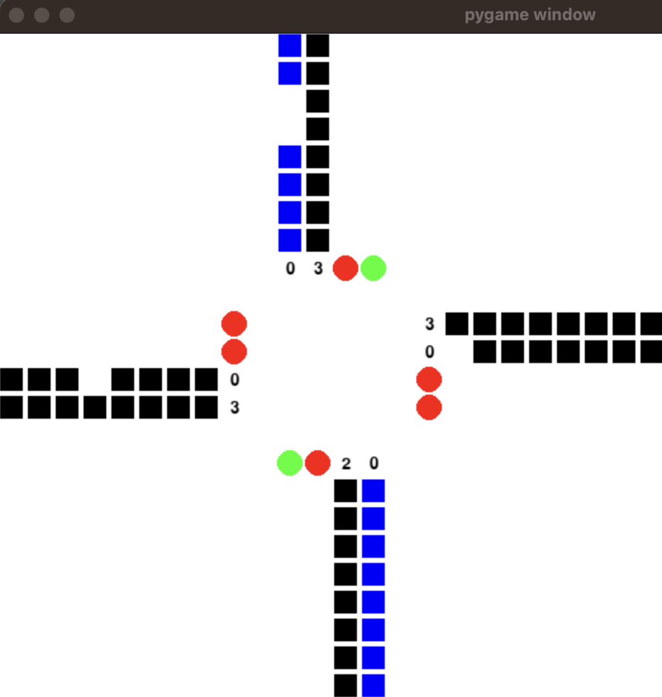

# Traffic-Intersection-Control-System

## How to run the program

Just run the file outputModule.py ->
python3 outputModule.py

A window should open showing the traffic flow and other relevant details.

In the config file its set for real time where for each second with some random probability the vehicle flow will be shown in the window.

To Test certain cases you can do the following :

Go to config.py and increase the VALIDATION and TIME_SLEEP to view for that many seconds.

Both values should be the same.

You can also play around with the # Traffic Pattern Vehicle Probability field to give different probability for different patterns to validate various cases. This field is also within the config.py file.

You can also change the max and min time limits within the config.py to see the changes soon for testing purpose.

## The Assumptions

I assumed that the Sensors ROI can detect 8 vehicles in a single lane. That is given in an array like this: lane = [0,1,0,1,1,0,0,1] the last element lane[-1] is the vehicle in the starting position of that lane and the first element lane[0] is the last vehicle’s position. 0 indicates that there are no vehicle in that position and 1 indicates that there is vehicle in that position.

The 8 elements in the array are the blocks here. When the array contains “1” then there is a vehicle present and in the above window the vehicles position denotes a square block and if it’s “0” then there is no vehicle and so it shows an empty space. The white space in-between are the ones where there are no vehicles. The Blue color represents the ongoing vehicles when the signal is green, the black ones are the stacked up vehicles where it has a stop sign. The numbers near the lanes in the above picture indicates the wait time of the vehicles in the lane.

When there is Red light the vehicles keep on stacking up until all the 8 places gets full. The occurrence of a vehicle is denoted by a probability with respect to that lane. Once the signal turns Green the wait time resets to Zero.

The max wait time is set to be 240 sec which I calculated using Max active times - sum of top 3 continues max active time : 60 + 60 + 120 = 240.

To determine when the traffic flow should follow the limits that are provided - the total sum of vehicles in every cycle should be not less than 5 to follow the limits.

When the traffic flow is not following the time limits as in when the vehicles are not queued in the opposing lanes:

The min change time of any signal when it turns to green is 8 sec and the maximum would be infinity.

The min active time of any pattern would be 0 sec.

The max active time would be infinity. 

## 1) The Sensor Module

In Sensor Module to determine the flow of vehicles into the lane, when it is Green signal for the particular lanes, then there will be flow of vehicles and in this case I pop out the last element from the array which is the starting position of the vehicle and insert a value at the front - either “1” or “0” depending on the probability of the vehicle frequency in the particular lane.

When it is Red, the vehicles keep on stacking. Until all the 8 places gets full. Which you can see in the animation.

If vehicles are stacking up, the maximum wait time will be the wait time of the vehicle in the front line.

## 2) Domain Logic Module

Every sec there will be flow of vehicles into the traffic intersection and the domain logic implemented is time based where the algorithm determines when to change the cycle order depending on the time and flow of vehicles to get the highest throughput.

### When not following the limits:

Here the min change time after light turn green is 8 sec and maximum change time would be infinity.

1) So first it checks for the max wait time in all the cycles and if it equal to the given condition then it will change to that cycle.

2) Else it will calculate the score of all the patterns. The score is calculated in such a way that it is the sum of each position of the lane array multiplied by its corresponding index in [0.3,0.4,0.5,0.6,0.7,0.8,0.9,1]. This way the priority is set. If any score after the 8 mandatory sec is greater than the current pattern then it will change to that pattern given the conditions:

First it checks if the first element in the current pattern is more closer to the starting point of the signal. If yes then pass this vehicle position and then change the cycle pattern.

### When following limits:

Do the same as when not following limits but extra we need to add the min and max active time for each pattern.

## 3) Output Module

The output module contains the pygame implementation where the elements in the signal lanes are changed every 1 sec. It shows the moving traffic, the stacked up traffic, the traffic light signals and the wait time count.

For Validation purpose, I’ve added the current pattern, the Score for the pattern and the vehicle count for that pattern in the screen. This will enable us to see if the cycle is changing in the correct order.

Also it shows if the cycle in “In Limits” or “Not in Limits”.

In “In Limit” condition it follows the Min and Max active time.
In “Not in Limit” condition it wont follow the limits.

This way it helps in the validation!!

